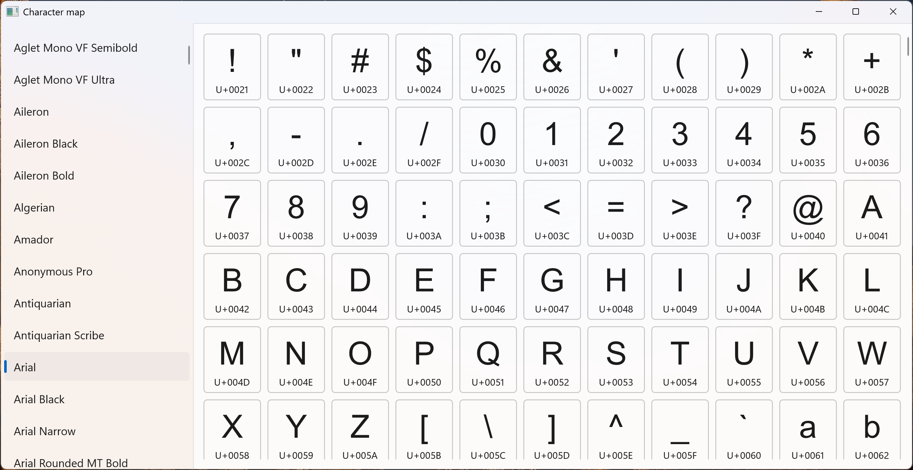

# CharMap Plus

An improved character map application, following Fluent design and adaptative triggers.

## Key features

- Comfortable view for displaying fonts and glyphs.
- Adaptative view for different window sizes.
- Fluent Design (WinUI 3)
- Clean Architecture implementation with separated layers
- Comprehensive unit and integration testing
- ... More upcoming features :)

## Project Structure

The solution [`CharMapPlus.sln`](CharMapPlus.sln) is organized into the following projects:

### Source Projects

- **[`CharMapPlus`](Source/CharMapPlus/)** - Main WinUI 3 application project containing views, view models, and UI components
- **[`CharMapPlus.Core`](Source/CharMapPlus.Core/)** - Core business logic and domain models
- **[`CharMapPlus.Infrastructure`](Source/CharMapPlus.Infrastructure/)** - Infrastructure layer for external services and data access

### Test Projects

- **[`CharMapPlus.Infrastructure.Tests`](Tests/CharMapPlus.Infrastructure.Tests/)** - Unit tests for the infrastructure layer
- **[`CharMapPlus.Infrastructure.IntegrationTests`](Tests/CharMapPlus.Infrastructure.IntegrationTests/)** - Integration tests for infrastructure components

## How it works

The application follows Clean Architecture principles with MVVM pattern, separating concerns across different layers:

### Presentation Layer (CharMapPlus)

The main application project contains:

- **Views**: WinUI 3 user controls and windows that interact with users
- **ViewModels**: MVVM view models that bind to views and coordinate with business logic
- **App Configuration**: Application manifest ([`app.manifest`](Source/CharMapPlus/app.manifest)) and packaging ([`Package.appxmanifest`](Source/CharMapPlus/Package.appxmanifest))

### Core Layer (CharMapPlus.Core)

Contains the business logic and domain models:

- Domain entities for fonts and glyphs
- Business rules and validations
- Application services interfaces

### Infrastructure Layer (CharMapPlus.Infrastructure)

Implements external concerns and data access:

- Font system integration
- Glyph retrieval services
- External library abstractions

### External Dependencies

The application uses external libraries to retrieve font and glyph collections:

#### Vortice.DirectWrite

An abstraction of Microsoft DirectWrite libraries, used to retrieve valid glyphs while skipping characters not included in the font character set.

## Getting Started

### Prerequisites

- .NET 6.0 or later
- Visual Studio 2022 or Visual Studio Code
- Windows 10/11

### Building the Application

1. Clone the repository
2. Open [`CharMapPlus.sln`](CharMapPlus.sln) in Visual Studio
3. Restore NuGet packages
4. Build the solution

### Running Tests

The solution includes comprehensive testing:

- Run unit tests from [`CharMapPlus.Infrastructure.Tests`](Tests/CharMapPlus.Infrastructure.Tests/)
- Run integration tests from [`CharMapPlus.Infrastructure.IntegrationTests`](Tests/CharMapPlus.Infrastructure.IntegrationTests/)

## Contributing

Contributions are welcome! Please feel free to submit a Pull Request.

## License

This project is licensed under the terms found in the [`LICENSE`](LICENSE) file.
